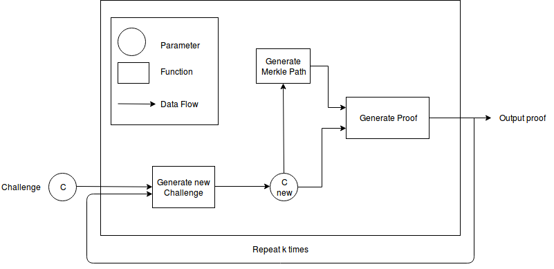
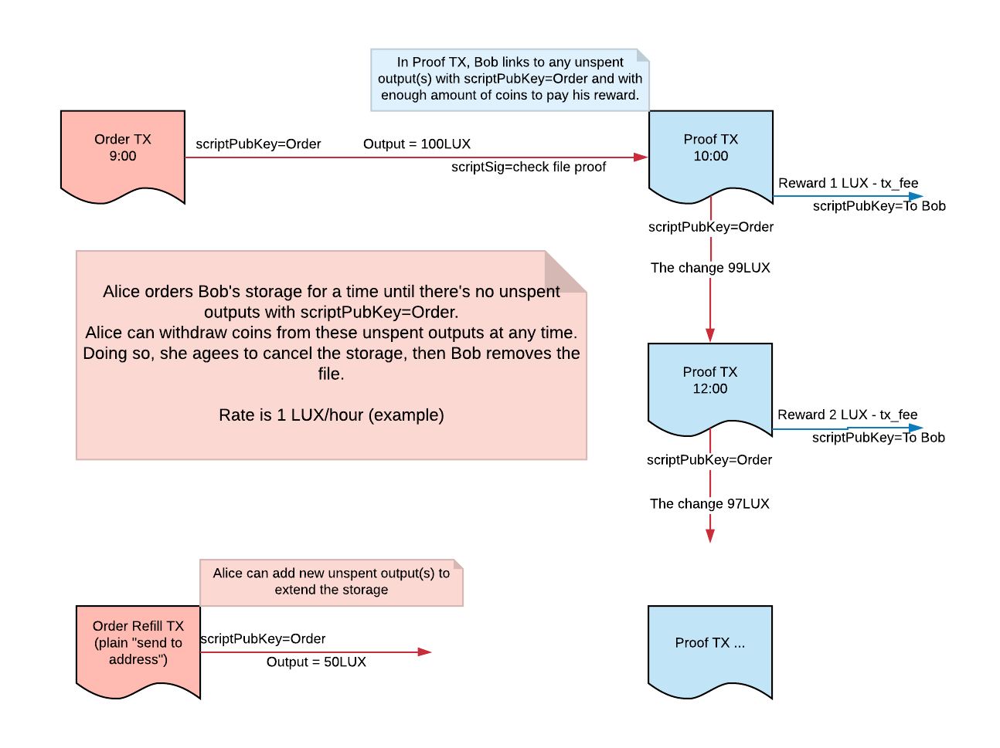

"FIRST OF ITS KIND"

Luxcore is GNU AGPLv3 licensed.

Technical description of the implementation of a distributed file storage based on the Luxcore blockchain
==========================================================================================================

## Table of Contents
<!-- AUTO-GENERATED-CONTENT:START (TOC:collapse=true&collapseText="Click to expand") -->

"Click to expand"

 
- [Roadmap](#Roadmap)
- [Milestones](#Milestones)
- [Description of various flows](#Description-of-various-flows)
  * [Description of the general principle of the entire network](#Description-of-the-general-principle-of-the-entire-network)
  * [Description of user functions](#Description-of-user-functions)
  * [Description of the PMN-node interaction protocol with dfs](#Description-of-the-PMN-interaction-protocol-with-dfs)
    * [Description of block file storage](#Description-of-block-file-storage)
    * [Description of the file storage proof algorithm](#Description-of-the-file-storage-proof-algorithm)
    * [Description of the reward system for file storage](#Description-of-the-reward-system-for-file-storage)
- [Features for future implementation](#Features-for-future-implementation)

<!-- AUTO-GENERATED-CONTENT:END -->
    
## Roadmap   

        • Q1 2019 - dfs testnet presentation
        • Q2 2019 - integration of dfs with ipfs
        • Q2 2019 - gateway presentation for access to dfs
        • Q3 2019 - dfs mainnet presentation
    
## Milestones 

| Description | Hours |
|:-----------|:-----------|
| Implementation of the block file storage | `80` |
| Implementation of the node interaction protocol for the functioning of dfs (decentralized file storage) | `160` |
| Implementation of dfs RPC commands | `40` |
| Implementation of the generation and verification algorithm of Merkle path to prove file storage | `40`   |
| Implementation of the reward system for file storage (transactions) | `80` |
| Bug fix & Testing | `160` |
| Total | `560` | 

## Description of various flows

### Description of the general principle of the entire network

Let's introduce several abbreviations used in the text below:

    DFS - decentralized file storage. 
    
    - PMN - parallel masternode. A new layer of masternodes of the Luxcoin network that implements dfs functionality 
      using its own protocol. PMNs are completely independent of the usual Luxcoin masternodes networks and 
      not support their protocol. PMN organize a network among themselves, by analogy with the usual masternodes.
   
    - To install a PMN, a Luxcoin network user should not undergo additional checks or block any amounts of coins 
      on his account (as was done for ordinary master notes). It is enough to have s GB of free disk space
      (s in the current implementation is a constant network parameter that is the same for all PMNs).
   
    - A user of any lux network node may request to add multiple copies of his file(s) to the PMN network for a 
      time-based fee. For this, a user needs to create a transaction of a certain type that stores the address 
      of the node that created the request, which will not be added to the blockchain but will be transmitted 
      over the network in the same way as normal transactions.
   
    - Each PMN-node receiving the request checks its remaining free space (x bytes) and sends its proposal for 
      storing the file to the node that created the request.
       
    - The node that initiated the request can validate it, having information in its blockchain about how much
      data any PMN currently stores.
   
    - A node that sent a request to add a file waits for a predetermined time (network parameter) receiving 
      messages from all PMN-nodes ready to fulfil its order and sorting them by priority (free space on the PMN). 
      Then selects n PMN, where n is the parameter specified in the original transaction as the number of copies
      of the file. And sends a message to these PMN-nodes for file transfer.
   
    - Next the file(s) are transferred to all selected PMN-nodes with a record of the Merkle root file(s), 
      the size of the file(s) on the blockchain.
    
    - The PMN node storing the file has the right once every t minutes (where t should be much longer than block
      mining time) to make a transaction, with [Proof of File Storage] and receive a reward equal to [p * t * s], 
      where p is the rate for storage (network parameter), s - size of stored data.
    
    - The user of any node of the lux network node can download the file saved in dfs, specifying the Merkle root 
      of the desired file.
    
    - The user of any node of the lux network node can check a file saved in dfs, indicating Merkle root the 
      desired file.
    
### Description of user functions

    - Count the Merkle root file or group of files on your local machine (parameters: path to the file or folder)
    
    - Polling of PMN-nodes, in order to find PMN-nodes that can save the file in dfs (parameters: Merkle root
      file(s), the timestamp to which the file will be stored)
    
    - Transferring a file from Alice to Bob, with the creation of StorageOrderTx by Alice. (parameters: the path
      to the file to be saved in dfs on the local machine, the number of copies, addresses from which funds will
       be written off for each of the PMN-nodes that store the file)
   
    - Check file availability in dfs (parameters: Merkle root file(s))
    
    - Download file from dfs (parameters: Merkle root file(s))
    
### Description of the PMN interaction protocol with dfs

#### Description of block file storage

    - A group of files to be saved is recorded in memory sequentially and working with it is equivalent to 
      working with a single file.
    
    - The file is divided into blocks of the same size (size is a parameter). The last block is complemented by 
      “nulls” to the desired size. For each block a hash is calculated using the number of bytes actually stored
       in the block.
    
    - For each block the sha-256 hash function is considered, the Merkle tree is formed from these hashes, the 
      root of which is subsequently stored in the blockchain.

#### Description of the file storage proof algorithm

    - The PMN-node keeps a file and a full Merkle root for it.
    
    - Once in t minutes, a node can generate a transaction to receive a reward.
    
    - In this transaction, k evidence is stored (network parameter), each of which corresponds to a deterministic
      Merkle tree path, depending on the previous path and iteration number i = 1..k i.e. in each proof
      transaction the PMN provides k blocks of the stored file, their hashes and the corresponding Merkle paths.
      The choice of k blocks for each proof case is determined by the corresponding blockchain algorithm and 
      depends on the previous proof.
   

  
`Fig 1. The scheme of the file storage proof algorithm`

#### Description of the reward system for file storage

    - When executing a request to save a file a DfsSubscribeTx transaction is created, which at the user’s new
      address blocks the funds equal to p * t * s, where p is the storage rate (network parameter), t is the 
      entire desired file storage time, s is the file size. In the future of these funds will be issued 
      a reward to PMN-node, which stores the asynchronously for each copy of the stored file (for each PMN,
      a separate transaction Dfsr SubscribeR is created by the initiator).
    
    - Each transaction with a file storage proof created by a PMN-node, uses the output of the address of the 
      corresponding DfsSubscribeTx transaction, sending the “change” back to the same address. Thus, from the 
      reserved funds, file storage payment is made periodically, during the specified storage period.
   
    - The initiator can extend the storage period for the file by creating a new DfsSubscribeTx transaction for 
      the same file and the same PMN that stores this file, and specifying the new retention period.
    
    - When the file has expired, the PMN-node ceases to guarantee that the file is stored for the
      rest of the network.
 

`Fig 2. Scheme of the PMN reward system for file storage.`

## Features for future implementation

    1. For the stated proof that the file is still stored in a decentralized network, a system of forced
       duplication of the file is necessary, in the event of a long absence of the node storing one of the
       copies of the file in the network. At the same time, the “missing node” should be added into blacklist,
       not be able to claim a reward for storing this file in the future.
   
    2. The variable amount of disk space that will be used for the functioning of dfs.
  
    3. Separate transaction pool for file save requests
  
    4. The mechanism for extending the file store period in dfs without reuploading the file into a 
       distributed network
   
    5. Transactions with proof of file storage, which would contain a report on all files that the PMN stores. 
       (In the current version there will be a separate transaction for each file)

`Updating...`

